**github账号注册**
***
1. **[登录github官网](https://github.com/)**
   
   

2. **注册github账号** 
   
   点击右上角的sign up注册，依次填入个人信息，有的地区可能会出现网站访问速度时间过长的问题，github服务器在国外，耐心等一会
   
   

3. **登录github账号**
   
   点击右上角的sign in，输入邮箱密码点击登录。
   
   

   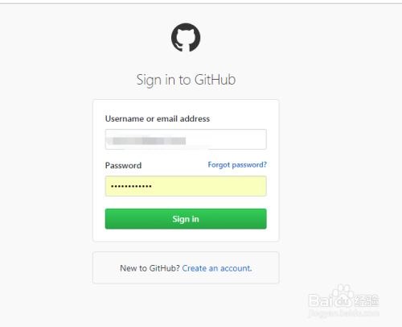

**创建github仓库**
***
1. **创建Git 仓库**
   
   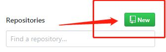

2.  **填写仓库信息**
   
     依次填入仓库名、描述、公共属性、readme、开源协议等等信息，如图详细介绍，（新手建议readme，.gitignore，协议没必要选，因为选择之后github会默认生成一些文件，之后的命令提示会省略）
  
  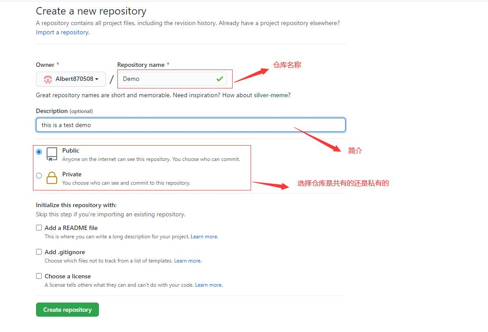
  
  完成之后一个仓库已经成功创建。

  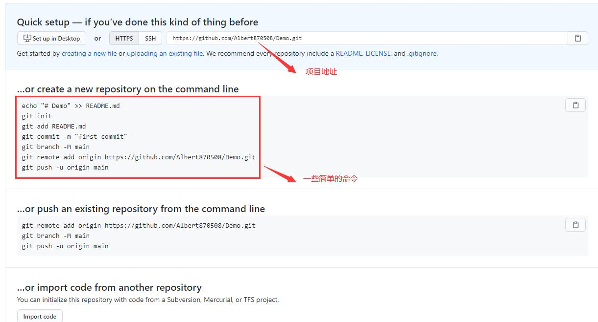

**git 安装**  
***
1.  **下载git**
   
    window下安装直接百度搜索“git download”，点击第一个页面进入

2. **安装git**
   
   下载完成直接下一步安装成功就好。

**github仓库上传**
***
1.  **启动Bash命令**
    
    进入文件目录，在文件中点击鼠标右键选择bash控制台进入

    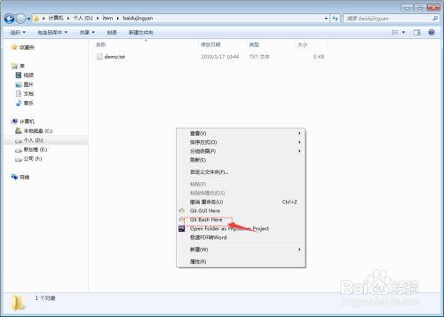

2. **初始化**
   
   运行 `git init` 命令，文件夹中会多出一个.git 命令（可能会隐藏）

   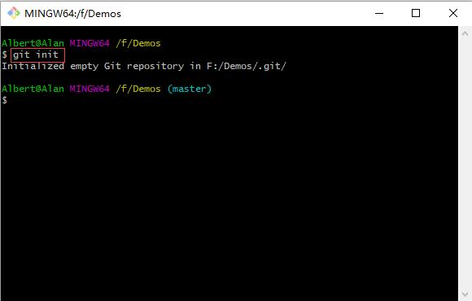
   
   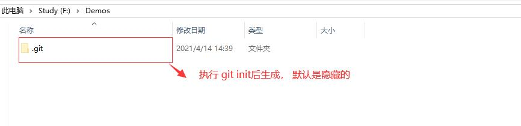

3. **上传文件**
   
   运行 `git add .` 命令（意思是将要上传本地所有文件）
   
   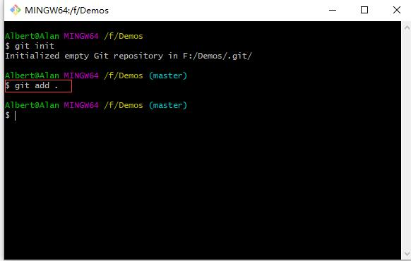

4. **提交**  
   
   运行 `git commit -m "first commit"` ，这是对本次修改的一个简单的描述

   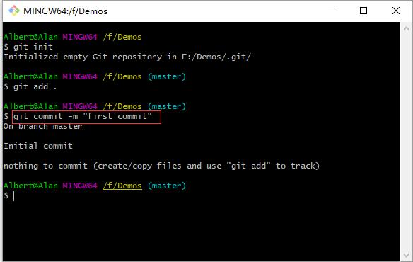

5. **添加快捷方式**
   
   `git remote add [命名] [项目地址]`

   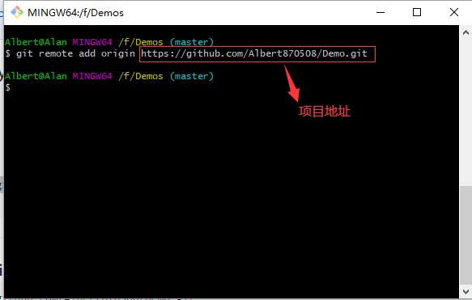

6.  **推送**
    
    第一次是不用pull的因为啥都没有，直接push即可
    
    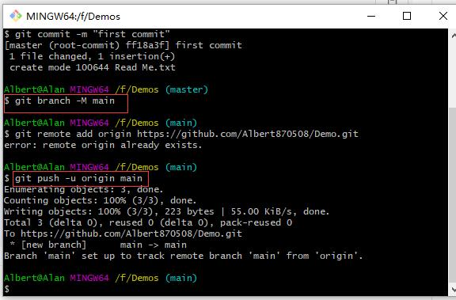

7.  刷新github项目页地址，我们的demo文件已经成功上传至远程仓库
    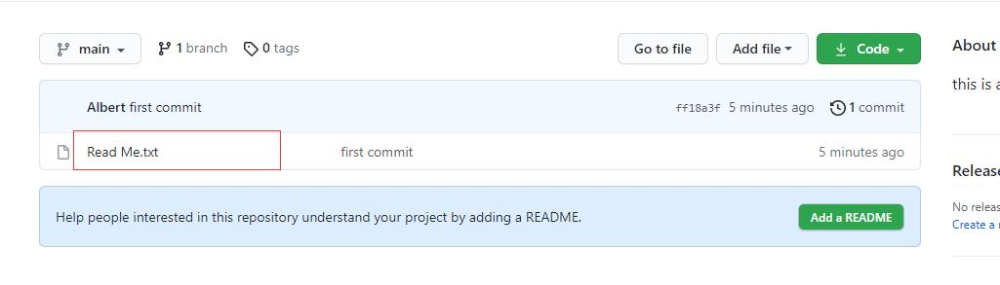

8. 后面每次提交基本都需要add->commit->pull->push这个过程，当然多人提交仓库难免会有其他分支、冲突等等，就需要好好研究git文档了

原文链接：[https://jingyan.baidu.com/article/64d05a020eecb7de55f73bd8.html](https://jingyan.baidu.com/article/64d05a020eecb7de55f73bd8.html)